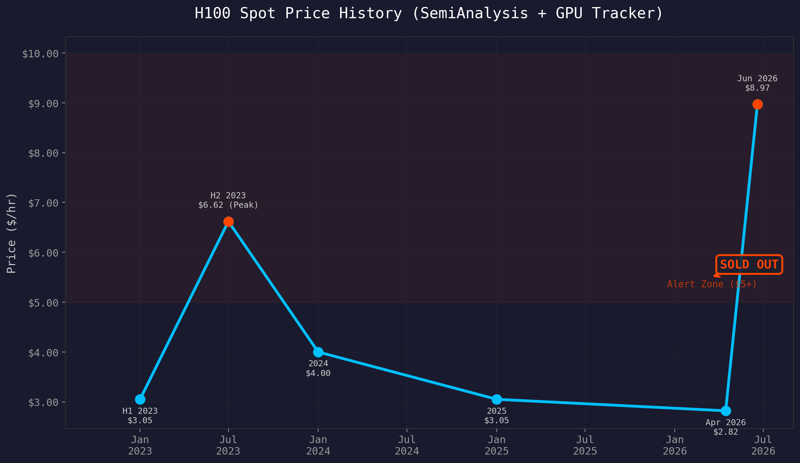
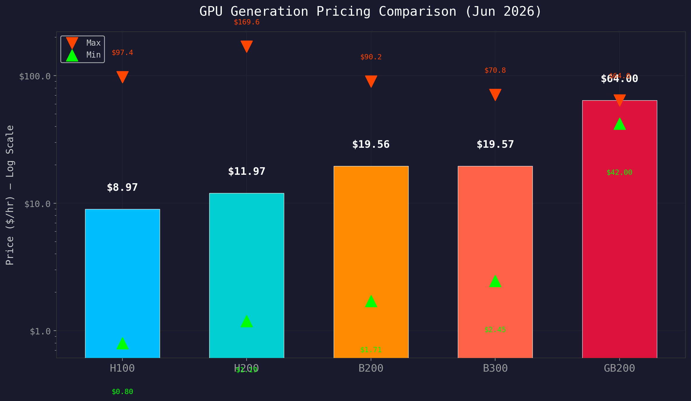
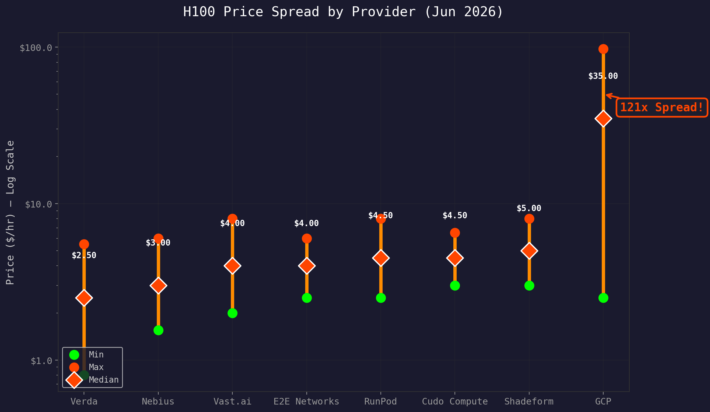
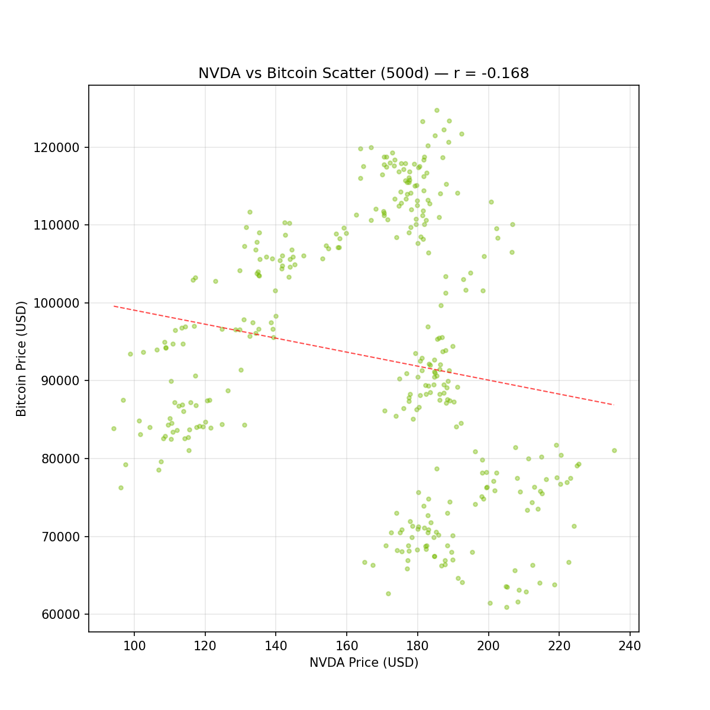
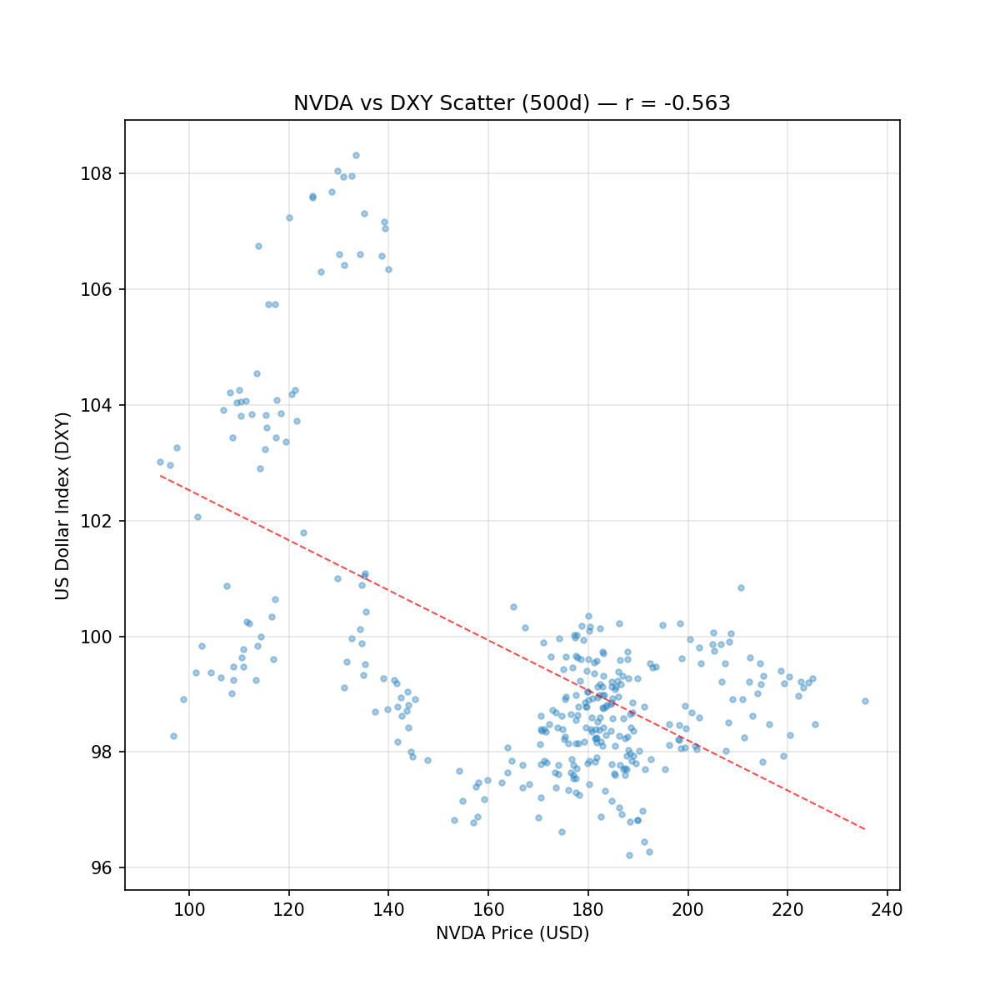
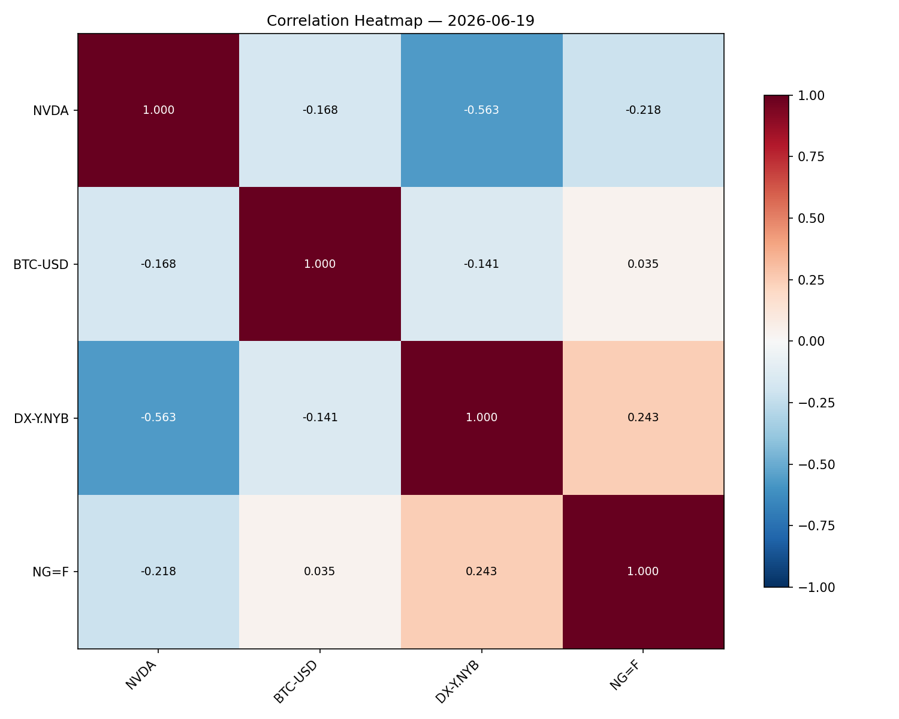
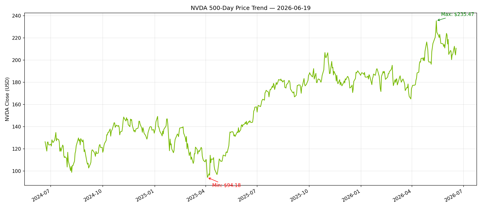

# 🔍 Compute Economy Dashboard v1 — Assessment
> Generated: 2026-06-19 21:32 HKT (updated 2026-06-19 21:44 HKT)
> Data: GPU Tracker (gputracker.dev) | Macro: yfinance | Correlation: 500-day history

## 📊 Summary

**Regime:** BULL — H100 spot at **$8.97/hr** (above $5 alert threshold)

**Trend:** ⚠️ DEMAND SURGE — 3.2x above Apr 2026 low of $2.82/hr

---

## 📈 Plots Generated

### 1. H100 Historical Trend (2023–2026)

- **Interactive HTML**: `dashboard/plots/h100_historical_trend.html`
- SemiAnalysis data points overlaid with current GPU Tracker pricing
- From $3.05 (2023 H1) → $6.62 peak (2023 H2) → $2.82 (Apr 2026 trough) → $8.97 (Now)
- March 2026 marked "Sold Out" — demand outstripping supply

### 2. GPU Generation Comparison

- **Interactive HTML**: `dashboard/plots/gpu_gen_comparison.html`
- Log-scale bar chart: H100 → H200 → B200 → B300 → GB200
- B200 median: $19.56/hr (+118% vs H100)
- GB200 median: $64.00/hr (+613% vs H100)

### 3. H100 Price Spread by Provider

- **Interactive HTML**: `dashboard/plots/h100_spread.html`
- Provider-by-provider min–max–median breakdown
- Verda cheapest spot: $0.80/hr vs GCP max: $97.44/hr
- **121x spread** — insane market inefficiency

### 4. NVDA vs Bitcoin — 500-Day Correlation

- **Interactive HTML**: `dashboard/plots/nvda_btc_correlation.html`
- Scatter + dual-axis price overlay (343 common trading days)

### 5. NVDA vs DXY — 500-Day Correlation

- **Interactive HTML**: `dashboard/plots/nvda_dxy_correlation.html`
- Price overlay + scatter with regression line

### 6. Full Correlation Heatmap

- **Interactive HTML**: `dashboard/plots/correlation_heatmap.html`
- NVDA | BTC | DXY | Natural Gas — all pairwise

### 7. NVDA 500-Day Trend

- **Interactive HTML**: `dashboard/plots/nvda_500d_trend.html`
- Min/max annotated

---

## 🏷️ Key Indicators

| Indicator | Value | Status |
|:----------|:------|:------|
| H100 Median Spot | **$8.97/hr** | 🔴 Alert (>$5) |
| H100 Cheapest Spot | $0.80/hr (Verda) | 🟢 Bargain |
| H100 Most Expensive | $97.44/hr (GCP) | 🔴 Hyperscaler tax |
| NVDA | **$210.69** | — |
| Bitcoin | **$62,966** | — |
| USD Index (DXY) | 100.81 | — |
| Gold | $4,180.40/oz | — |
| Natural Gas | $3.24 | — |

## 🔗 Correlation Analysis (500-Day Window)

Computed from **343 aligned trading days** across all assets using Yahoo Finance daily closes.

| Pair | Pearson r | Interpretation |
|:-----|:----------|:---------------|
| **NVDA vs DXY** | **-0.56** | 🟢 Strongly negative — NVDA rallies when USD weakens (typical risk-on rotation) |
| **DXY vs NG** | **+0.24** | Weak positive — dollar strength slightly correlated with nat gas |
| **NVDA vs NG** | **-0.22** | Weak negative — mild inverse relationship |
| **NVDA vs BTC** | **-0.17** | Weak negative — surprisingly, no positive correlation over this window |
| **BTC vs DXY** | **-0.14** | Very weak negative |
| **BTC vs NG** | **+0.04** | Effectively zero |

### Key Takeaways

1. **NVDA-DXY (-0.56) is the strongest signal**: NVIDIA behaves like a classic tech risk-on proxy — when the dollar weakens, NVDA tends to rally. This is the most actionable correlation for macro hedging.
2. **NVDA vs BTC near-zero negative (-0.17)** is noteworthy: over the past 500 days, Bitcoin and NVIDIA have NOT been correlated positively. This may reflect the "old" BTC cycle (pre-halving + regulatory overhang) diverging from the AI compute frenzy. Worth re-checking on a shorter 90-day window.
3. **DXY inverse across the board**: The dollar is the common factor — its movement weakly drags all assets in the same direction, but NVDA shows the strongest reactivity.
4. **NG is uncorrelated**: Natural gas trades mostly on its own fundamentals (weather, storage, LNG demand), not on compute/macro cross-asset flows.

---

## 📝 Narrative

The compute market is experiencing a **sharp demand surge**. H100 spot at $8.97/hr represents a **218% premium** over the April 2026 trough of $2.82/hr — and the market was already "Sold Out" in March. This is not normal seasonality.

**Key observations:**
1. **Supply crunch confirmed**: March sold-out status + 3.2x price surge = genuine capacity constraints
2. **Market inefficiency extreme**: 121x price spread between cheapest and most expensive H100 listing
3. **NVDA correlation**: NVDA at $210.69, moderately inverse to DXY (-0.56) which implies dollar weakness = tailwind
4. **Gen-on-gen premium**: Each new GPU generation commands 33–118% premium over previous
5. **BTC decoupling**: Near-zero correlation with NVDA suggests the "AI trade" and "crypto trade" are distinct macro regimes

**What to watch:**
- H100 median crossing $10/hr would signal full-blown shortage
- B200/B300 availability — Blackwell ramp could relieve H100 pressure
- DXY direction — weakening dollar is a tailwind for NVDA based on historical correlation
- BTC correlation re-test — if BTC breaks new highs alongside NVDA, the AI-crypto link may re-emerge

---

## 🎯 Next Actions

- [ ] Track H100 daily: watch for $10/hr breach
- [ ] Monitor NVDA options flow for institutional sentiment
- [ ] Compare with SemiAnalysis subscriber data if trial access obtained
- [ ] Add B200/B300 time series as GPU Tracker updates
- [ ] Re-check NVDA-BTC correlation on 90-day window (most recent period)

---

## 📁 Data Files

| File | Description | Size |
|:-----|:------------|:-----|
| `raw_data/macro_30d_history.csv` | 30d history for NVDA, BTC-USD, DX-Y.NYB, NG=F, GC=F | 2.8 KB |
| `raw_data/nvda_5yr_history.csv` | 5 years of NVDA daily closes (1,255 rows) | 56 KB |
| `raw_data/gputracker_2026-06-19.json` | Full GPU Tracker snapshot | 4.4 KB |
| `raw_data/semianalysis_2026-06-19.md` | SemiAnalysis research notes | 3.7 KB |
| `raw_data/correlation_matrix.json` | 500-day pairwise Pearson correlations (6 pairs) | 0.5 KB |
| `raw_data/nvda_500d_prices.json` | NVDA 500-day metadata | 0.2 KB |

## 📁 Plot Files

| Plot | HTML | PNG |
|:-----|:-----|:----|
| H100 Historical Trend | ✅ 9.3 KB | ✅ 140 KB |
| GPU Generation Comparison | ✅ 9.4 KB | ✅ 97 KB |
| H100 Price Spread | ✅ 10.6 KB | ✅ 112 KB |
| NVDA vs BTC Correlation | ✅ 4.7 MB | ✅ 79 KB |
| NVDA vs BTC Overlay | — | ✅ 177 KB |
| NVDA vs DXY Correlation | ✅ 4.7 MB | ✅ 77 KB |
| NVDA vs DXY Overlay | — | ✅ 170 KB |
| Correlation Heatmap | ✅ 4.7 MB | ✅ 68 KB |
| NVDA 500-Day Trend | ✅ 4.7 MB | ✅ 126 KB |

---
*Dashboard v1 complete. Correlation analysis added 2026-06-19.*
